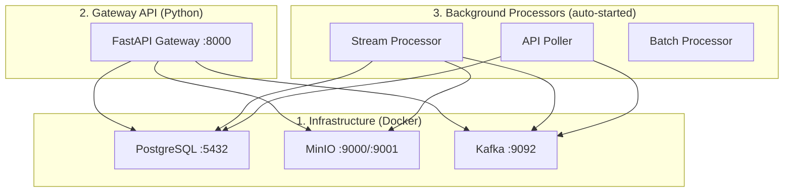

# HVE-OS Platform — Complete Runbook

## Architecture Overview

The platform has **3 layers** that must be started in order:



---

## Step 1: Start Infrastructure (Docker Compose)

> [!IMPORTANT]
> Docker must be running before anything else. All three services (PostgreSQL, MinIO, Kafka) are required.

```powershell
cd d:\hive_platform
docker-compose up -d
```

This starts:

| Service | Container | Port(s) | Purpose |
|---------|-----------|---------|---------|
| **PostgreSQL 15** | `hve-postgres` | `5432` | Control Plane database (Source Registry, Blueprints, DQ Rules, Silver Registry) |
| **MinIO** | `hve-minio` | `9000` (API), `9001` (Console UI) | Object storage for Bronze/Silver/DLQ data |
| **Kafka (KRaft)** | `hve-kafka` | `9092` | Stream buffer for real-time telemetry |
| **MinIO Init** | `hve-minio-init` | — | Sidecar: auto-creates `hve-bronze` and `hve-silver` buckets |
| **Kafka Init** | `hve-kafka-init` | — | Sidecar: auto-creates `raw-telemetry` topic (3 partitions, 7-day retention) |

**Credentials:**
- PostgreSQL: `hve_admin` / `hve_password123` (DB: `hve_control_plane`)
- MinIO: `hve_admin` / `hve_password123`

**Verify infrastructure:**
```powershell
docker-compose ps
```

**Access MinIO Console:** Open [http://localhost:9001](http://localhost:9001) and log in with the MinIO credentials.

---

## Step 2: Install Python Dependencies

```powershell
cd d:\hive_platform
# Activate virtual environment (if not already active)
.\venv\Scripts\Activate.ps1

# Install gateway dependencies
pip install -r src\gateway\requirements.txt
```

### Dependencies

| Package | Purpose |
|---------|---------|
| `fastapi` + `uvicorn` | API framework & server |
| `minio` | MinIO S3-compatible client |
| `confluent-kafka` | Kafka producer & consumer |
| `psycopg2-binary` | PostgreSQL driver |
| `pandas` + `pyarrow` | Data processing & Parquet I/O |
| `duckdb` | SQL query engine over Parquet |
| `aiohttp` | Async HTTP for API Poller |
| `python-multipart` | File upload support |
| `openpyxl` | Excel file reading |

---

## Step 3: Start the Gateway API

```powershell
cd d:\hive_platform\src\gateway
python main.py
```

Or with hot-reload:
```powershell
cd d:\hive_platform\src\gateway
uvicorn main:app --host 0.0.0.0 --port 8000 --reload
```

On startup, the Gateway **automatically** launches:
1. **Stream Processor** — Kafka consumer that batches messages → Bronze → Silver
2. **API Poller** — Background async loop that polls registered external APIs

**Base URL:** `http://127.0.0.1:8000`  
**Swagger Docs:** [http://127.0.0.1:8000/docs](http://127.0.0.1:8000/docs)

---

## All API Endpoints

### Health Check

| Method | Endpoint | Description |
|--------|----------|-------------|
| `GET` | `/health` | Returns connectivity status for PostgreSQL, MinIO, and Kafka |

```powershell
curl http://127.0.0.1:8000/health
```

---

### Ingest Router — `POST /api/v1/ingest/*`

#### 1. Stream Ingestion (Real-time JSON → Kafka)

```
POST /api/v1/ingest/stream
```

Wraps payload in a Canonical Envelope, fires to Kafka `raw-telemetry` topic. Returns `202 Accepted`.

```powershell
curl -X POST http://127.0.0.1:8000/api/v1/ingest/stream `
  -H "Content-Type: application/json" `
  -d '{"source_id": "test_sensor", "data": {"temperature": 25.3, "humidity": 60, "location": "hangar_a"}}'
```

#### 2. Pre-Signed URL (Large file upload bypass)

```
POST /api/v1/ingest/presigned-url
```

Returns a MinIO direct-upload URL valid for 1 hour. For files >100MB.

```powershell
curl -X POST http://127.0.0.1:8000/api/v1/ingest/presigned-url `
  -H "Content-Type: application/json" `
  -d '{"source_id": "historical_dump", "filename": "huge_dataset.csv"}'
```

Then upload directly to the returned URL:
```powershell
curl -X PUT "<returned_upload_url>" --upload-file "C:\path\to\huge_dataset.csv"
```

#### 3. Static File Upload (Direct upload + full pipeline)

```
POST /api/v1/ingest/upload-static
```

Uploads a file (≤100MB) and processes it through the full Bronze → Transform → DQ → Silver pipeline. Returns `201 Created`.

Supported formats: `.csv`, `.json`, `.geojson`, `.parquet`, `.xlsx`, `.xls`, `.tsv`

```powershell
curl -X POST http://127.0.0.1:8000/api/v1/ingest/upload-static `
  -F "file=@d:\hive_platform\test_flights.csv" `
  -F "source_id=test_flights"
```

#### 4. Register External API for Polling

```
POST /api/v1/ingest/register-api
```

Registers an external API to be polled at a configurable interval. Data goes through Kafka → Bronze → Silver.

```powershell
curl -X POST http://127.0.0.1:8000/api/v1/ingest/register-api `
  -H "Content-Type: application/json" `
  -d '{
    "source_id": "opensky_live",
    "api_url": "https://opensky-network.org/api/states/all?lamin=20&lomin=70&lamax=35&lomax=90",
    "method": "GET",
    "poll_interval_seconds": 60,
    "auth_type": "NONE",
    "description": "OpenSky Network live flight data"
  }'
```

Auth types supported: `NONE`, `API_KEY`, `BEARER`, `BASIC`

---

### Control Plane Router — `/api/v1/sources/*`

#### 5. Register a Data Source

```
POST /api/v1/sources/register
```
```json
{
  "source_id": "my_new_source",
  "source_type": "STREAM",
  "protocol": "HTTP",
  "description": "My custom data source"
}
```

#### 6. List All Sources

```
GET /api/v1/sources
```
```powershell
curl http://127.0.0.1:8000/api/v1/sources
```

#### 7. Get a Specific Source

```
GET /api/v1/sources/{source_id}
```

#### 8. Delete a Source (cascades to blueprints, DQ rules, API configs)

```
DELETE /api/v1/sources/{source_id}
```

#### 9. Set Mapping Blueprints for a Source

```
POST /api/v1/sources/{source_id}/blueprints
```
```json
[
  {"target_field": "icao24", "json_path": "$.states[*][0]", "data_type": "STRING", "is_primary_key": true},
  {"target_field": "altitude", "json_path": "$.states[*][7]", "data_type": "FLOAT"}
]
```

#### 10. Get Blueprints for a Source

```
GET /api/v1/sources/{source_id}/blueprints
```

#### 11. Add a Data Quality Rule

```
POST /api/v1/sources/{source_id}/dq-rules
```
```json
{
  "rule_name": "altitude_non_negative",
  "rule_logic": "altitude >= 0 or altitude is None",
  "action_on_fail": "QUARANTINE",
  "severity": "ERROR"
}
```

#### 12. Get DQ Rules for a Source

```
GET /api/v1/sources/{source_id}/dq-rules
```

---

### Query Router — `/api/v1/*`

#### 13. List All Silver Tables

```
GET /api/v1/silver/tables
```
```powershell
curl http://127.0.0.1:8000/api/v1/silver/tables
```

#### 14. SQL Query Against Silver Tables

```
POST /api/v1/query
```
```json
{
  "sql": "SELECT * FROM test_flights WHERE altitude > 30000",
  "limit": 100
}
```

Uses DuckDB under the hood to query Parquet files stored in MinIO.

#### 15. Preview a Silver Table

```
GET /api/v1/silver/tables/{table_name}/preview?limit=10
```

---

## CLI Ingestion Tool

The [hve_ingest.py](file:///d:/hive_platform/scripts/hve_ingest.py) script is a standalone CLI for interacting with the gateway.

### Stream Real-time JSON

```powershell
python scripts\hve_ingest.py stream --source "my_api" --data '{"key": "value", "telemetry": 123}'
```

Or from a file:
```powershell
python scripts\hve_ingest.py stream --source "opensky_data" --file "my_api_response.json"
```

### Upload a Static File (via Pre-Signed URL)

```powershell
python scripts\hve_ingest.py batch --source "historical_dump" --path "C:\path\to\my_huge_file.csv"
```

> [!NOTE]
> The CLI targets `http://127.0.0.1:8000/api/v1/ingest` by default. Override with the `HVE_API_URL` environment variable.

---

## Test Scripts

### Full End-to-End Test

Runs health check → stream ingest → static file upload → list sources → list silver tables → SQL query → stream-wait-query:

```powershell
cd d:\hive_platform
python scripts\test_e2e.py
```

### Quick Query Test

Tests querying `test_flights` and `test_sensor` tables, and lists silver tables:

```powershell
cd d:\hive_platform
python scripts\test_query.py
```

---

## Complete Startup Sequence (TL;DR)

```powershell
# 1. Start infrastructure
cd d:\hive_platform
docker-compose up -d

# 2. Wait ~15 seconds for Kafka/MinIO init sidecars

# 3. Activate venv & install deps (first time only)
.\venv\Scripts\Activate.ps1
pip install -r src\gateway\requirements.txt

# 4. Start the API (auto-starts Stream Processor + API Poller)
cd src\gateway
python main.py

# 5. Test everything
cd d:\hive_platform
python scripts\test_e2e.py
```

---

## Environment Variables (Optional Overrides)

| Variable | Default | Purpose |
|----------|---------|---------|
| `POSTGRES_HOST` | `localhost` | PostgreSQL host |
| `POSTGRES_PORT` | `5432` | PostgreSQL port |
| `POSTGRES_DB` | `hve_control_plane` | Database name |
| `POSTGRES_USER` | `hve_admin` | DB username |
| `POSTGRES_PASSWORD` | `hve_password123` | DB password |
| `MINIO_URL` | `localhost:9000` | MinIO endpoint |
| `MINIO_ROOT_USER` | `hve_admin` | MinIO access key |
| `MINIO_ROOT_PASSWORD` | `hve_password123` | MinIO secret key |
| `KAFKA_BROKERS` | `localhost:9092` | Kafka bootstrap servers |
| `HVE_API_URL` | `http://127.0.0.1:8000/api/v1/ingest` | CLI tool target |
